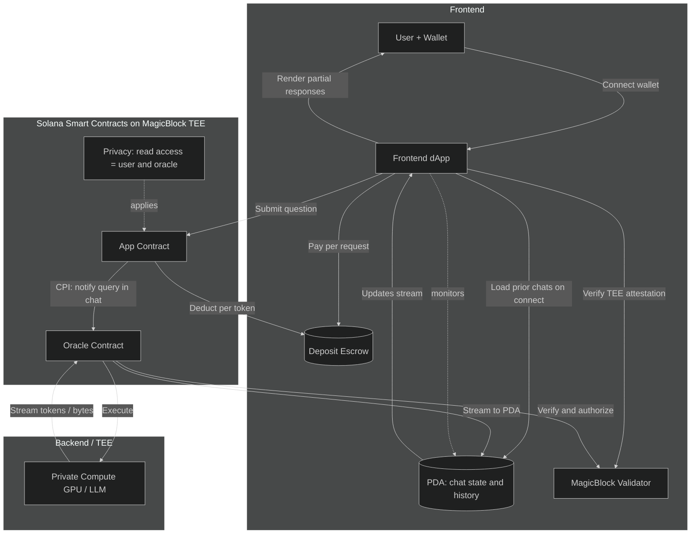

## Core Components

<Columns cols={3}>
  <Card title="Client Agents" icon="user-secret">
    You operate personal clients that hold preferences, budgets, and routing policy for every request.
  </Card>
  <Card title="Service Agents" icon="cubes">
    Specialized models advertise capability vectors and execute inside trusted execution environments.
  </Card>
  <Card title="Capability Registry" icon="diagram-project">
    A decentralized index maps capability embeddings to the agents that can fulfill them.
  </Card>
</Columns>

## Request Lifecycle

<Steps>
<Step title="Discover">
  You embed your request, compare it against published capability vectors, and shortlist candidate agents using cosine similarity.
</Step>
<Step title="Attest">
  Each candidate returns a hardware attestation quote. You verify code hashes and hardware fingerprints before sharing encrypted payloads.
</Step>
<Step title="Chain">
  Primary agents can invoke downstream specialists via functional tokens, creating execution graphs without leaking raw context.
</Step>
</Steps>

## Execution Graph Topology

<AccordionGroup>
<Accordion title="Master Nodes">
  Master agents maintain user state in graph databases for sub-second retrieval, while delegating heavy computation to workers.
</Accordion>
<Accordion title="Worker Nodes">
  Workers focus on domain-specific inference, reuse shared base models with lightweight adapters, and publish health heartbeats for routing.
</Accordion>
<Accordion title="Market Dynamics">
  Pricing adjusts to demand. Agents with sustained usage cluster alongside complementary capabilities, reducing latency and payment hops.
</Accordion>
</AccordionGroup>

<Info>
You should assume the network will evolve continuously—publishers push new capability vectors, and your routing logic should tolerate churn.
</Info>
