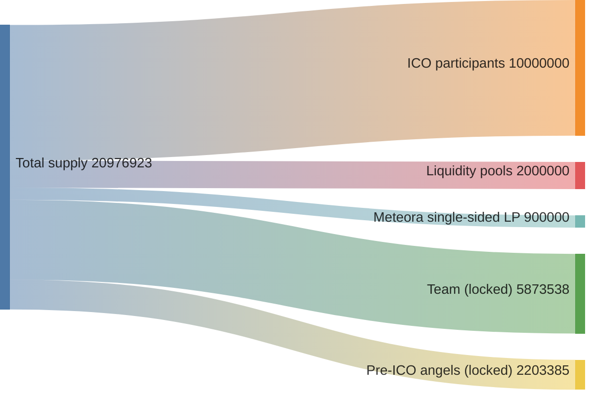

<Info>You help us -> you do public good -> we help people -> number goes up -> everyone's happy</Info>

| Bucket | Allocation | Notes |
| --- | --- | --- |
| ICO participants | 10,000,000 LOYAL | Pro-rata distribution on Oct 18 raise. |
| Liquidity (DEX pools) | 2,000,000 LOYAL | Provides immediate trading depth post-ICO. |
| Meteora single-sided liquidity | 900,000 LOYAL | Stabilizes pricing and cross-pair routing. |
| Team | 5,873,538 LOYAL | 18-month lock. Unlock cliffs at 2×, 4×, 8×, 16×, and 32× ICO price to keep incentives tightly aligned. |
| Pre-ICO angels | 2,203,385 LOYAL | Same vesting as team. |

## Raise Overview

- October 18, 11:00 PM UTC. Minimum raise target: $500,000. Final cap is determined after the raise based on demand and treasury planning; our commitment is to stay “omega reasonable.”
- 10,000,000 LOYAL tokens are allocated pro-rata among participants. Your share scales with your contribution.
- 2,000,000 LOYAL seed the primary liquidity pool; an additional 3,000,000 LOYAL go into a single-sided position on Meteora to keep order books tight from day one.

> Total supply: 20,976,923 LOYAL. Rounding across pools vs. percentages may differ slightly because liquidity buckets are denominated in whole tokens.

## Treasury Custody & Allowance

- All ICO proceeds flow into a Squads multisig governed by the MetaDAO. The core team has a default monthly allowance of $45K; any withdrawal above that ceiling or any change to the cap must pass a DAO vote. As operations scale, we will propose new budgets transparently.
- Treasury dashboards will publish remaining runway, burn rate, and allowance usage so holders can calibrate future proposals.
- The DAO will ratify long-term treasury policies, including how to handle additional liquidity provisioning, treasury diversification, or emergency reserves.

## Value Flywheel & Revenues

We anticipate two primary revenue streams that accrue to the DAO:

1. Loyal-operated (and community-operated) TEEs earn a margin on every inference request they fulfill.
2. Each on-chain job pays a protocol fee that routes to the treasury by default.

The DAO will decide how to redeploy those funds: expanding the monthly allowance, buying and burning LOYAL, deepening liquidity, or financing grants. Expect an initial governance proposal after mainnet volumes stabilize.

Help the network launch, secure private AI for everyone, and align long-term upside with real usage—public good → adoption → number go up. We'll build, but you keep us honest. We'll earn, but you decide how it compounds. We'll defend privacy, together.
